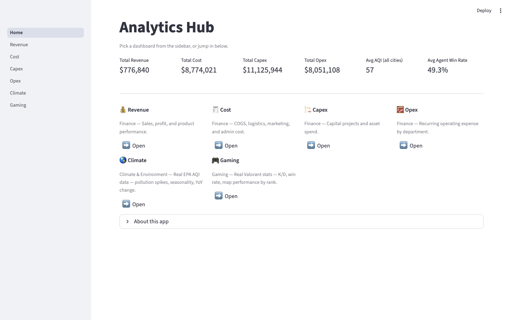

# Analytics Hub

A multi-dashboard analytics suite built with Streamlit — **9 dashboards**
across Finance, Climate, Gaming, Real Estate, Supply Chain, and Careers,
**5 of them backed by real public datasets** (not synthetic filler),
built as a modular monolith with a clean data/presentation split.




## Dashboards

| Dashboard | What it shows | Data |
|---|---|---|
| 💰 Revenue | Sales, profit, product performance | Illustrative sample data |
| 🧾 Cost | COGS, logistics, marketing, admin spend | Synthetic (generated) |
| 🏗️ Capex | Capital projects, asset spend | Synthetic (generated) |
| 🧮 Opex | Recurring operating expense by department | Synthetic (generated) |
| 🌎 Climate | Pollution spikes, seasonality, YoY AQI change | **Real** — US EPA AirData |
| 🎮 Gaming | K/D, win rate, map performance by rank | **Real** — Valorant stats via blitz.gg |
| 🏠 Real Estate | Home values by city, bedrooms, price range, map | **Real** — Zillow Home Value Index |
| 🚚 Logistics | Delivery times, on-time rates, freight cost, by region | **Real** — USAID SCMS shipment data |
| 💼 Job Market | Salary by role/industry, demand by city | **Real** — Ask a Manager salary survey |

Every dashboard has an **Overview** tab (KPIs + core charts) and an
**Insights** tab (trend decomposition, heatmaps, treemaps, Pareto/80-20
analysis) — both fit on one screen with no scrolling.

## Quick start

```bash
python3 -m venv .venv
source .venv/bin/activate   # on Windows: .venv\Scripts\activate
pip install -r requirements.txt
streamlit run app/Home.py
```

Or use the convenience launcher, which activates the venv for you:

```bash
./run.sh
```

If a `.venv` already exists in this folder, just activate it
(`source .venv/bin/activate`) before running — running with your
system/Anaconda Python instead of the venv is why `streamlit run ...`
may fail with "command not found". The venv must be activated in
*every new terminal window/tab*.

## Architecture

```
app/
  Home.py                 # landing page: combined KPIs + navigation
  pages/                  # presentation only — one page per dashboard
    1_Revenue.py
    2_Cost.py
    3_Capex.py
    4_Opex.py
    5_Climate.py
    6_Gaming.py
    7_RealEstate.py
    8_Logistics.py
    9_JobMarket.py
  services/                # data loading + filtering + business logic
    revenue_service.py      # — one module per domain, mirrors pages/
    cost_service.py
    capex_service.py
    opex_service.py
    climate_service.py
    gaming_service.py
    realestate_service.py
    logistics_service.py
    jobmarket_service.py
  common/
    styling.py             # shared page/chart styling helpers
    charts.py               # shared chart builders (heatmap, treemap, pareto, stacked area)
data/
  *.csv                    # one dataset per dashboard (see Data provenance)
  generate_synthetic_data.py
  fetch_*.py               # one fetch/clean script per real dataset
```

Pages never read a CSV directly — they always go through their
service module, which is the only thing that touches `data/`. Shared
layout and chart-building logic lives in `common/`, reused by every
page instead of duplicated per dashboard.

This is a **modular monolith**, not networked microservices — no
separate processes or ports per domain. One Streamlit process, one
`./run.sh`, with clean domain boundaries enforced in code instead of
over the network. Simpler to run and debug locally while staying
cleanly separated.

## Data provenance

| Dashboard | Source | Notes |
|---|---|---|
| Revenue | `data/sales_data.csv` | Illustrative sample data, not real transactions |
| Cost / Capex / Opex | `data/generate_synthetic_data.py` | Synthetic, deterministic (fixed random seed) |
| Climate | [US EPA AirData](https://aqs.epa.gov/aqsweb/airdata/download_files.html) (public domain) | Daily AQI, 20 US metro counties, 2023–2024. No temperature column — EPA AirData doesn't publish one |
| Gaming | [valorant-stats](https://github.com/IronicNinja/valorant-stats) (scraped from blitz.gg) | Aggregate snapshot per agent/map/rank, not match history — no calendar-time dimension, so rank tier (Iron → Diamond) stands in as the trend axis |
| Real Estate | [Zillow Home Value Index](https://www.zillow.com/research/data/) (Zillow Research) | 20 US cities × 5 bedroom counts, monthly 2020–2026. ZHVI is a smoothed city-level estimate, not per-listing prices — map plots city centroids, not individual properties |
| Logistics | [USAID SCMS Delivery History](https://github.com/jrcinco/supply-chain-shipment-price-data) | ~10,000 real health-commodity shipments, 43 countries, 2006–2015. No warehouse/inventory dimension, so no stock-levels metric |
| Job Market | [Ask a Manager 2019 salary survey](https://github.com/kmamykin/askamanager_salary_survey) | ~11,500 real US survey responses after cleaning. No "skills required" field, so no skills-trend chart. "Responses" = survey respondents, not live postings |

Every real-data dashboard is upfront in its own UI (and in the fetch
script's docstring) about what the source data does *not* contain,
rather than filling gaps with invented numbers.

## Regenerating data

```bash
# Synthetic (deterministic, fixed seed)
python3 data/generate_synthetic_data.py

# Real — each requires network access to its source
python3 data/fetch_climate_data.py       # aqs.epa.gov
python3 data/fetch_gaming_data.py        # raw.githubusercontent.com
python3 data/fetch_realestate_data.py    # files.zillowstatic.com, ~200MB download
python3 data/fetch_logistics_data.py     # raw.githubusercontent.com
python3 data/fetch_jobmarket_data.py     # raw.githubusercontent.com
```

## More

See [`BUILD_WRITEUP.md`](BUILD_WRITEUP.md) for a reflective write-up —
project overview, datasets, the actual prompts used to build this end
to end, iterations tried, and what stood out about the workflow.

See [`SESSION_LOG.md`](SESSION_LOG.md) for the full build history —
every prompt, decision, bug found and fixed, and verification step
across all 9 dashboards, with screenshots in [`screenshots/`](screenshots/).
